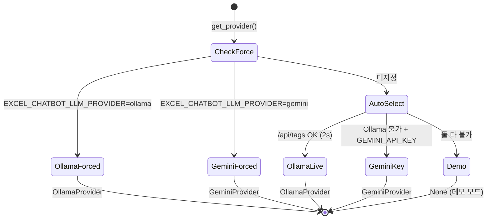

# 아키텍처

이 문서는 excel-chatbot의 계층 구조, 실행 흐름, 그리고 핵심 설계 결정의
근거를 설명합니다.

## 1. 설계 목표

LLM 기반 데이터 분석 도구의 가장 큰 위험은 **그럴듯하지만 틀린 숫자**입니다.
이 프로젝트는 다음 순서로 그 위험을 제거합니다.

1. **구조적 차단** — LLM은 계산을 하지 않는다. 계획(JSON)만 생성한다.
2. **실행 전 검증** — 계획이 스키마·타입·참조 무결성을 통과해야 실행된다.
3. **실행 후 검증** — 모든 연산 결과가 불변식 검사를 거친다.
4. **측정** — 트레이스와 평가 하네스로 정확도가 회귀 측정된다.

## 2. 계층 구조

```
domains → core → llm → agent → ui
```

의존은 항상 오른쪽에서 왼쪽으로만 향합니다. 역방향 import는 없습니다.

| 계층 | 책임 | 금지 사항 |
|---|---|---|
| `domains/` | 문서 양식 감지·정규화·어휘·파생지표 | core/llm/agent import 금지 |
| `core/` | 순수 DataFrame 연산, Workspace, 스키마, 검증, 트레이스 | LLM·Streamlit 의존 금지 |
| `llm/` | 프로바이더 추상화, intent/codegen 프롬프트 | agent·streamlit import 금지 |
| `agent/` | 라우팅, 오케스트레이션, 응답 포맷팅 | — |
| `ui/` | Streamlit 렌더링 | `agent.executor.run` 외 로직 호출 금지 |

## 3. 실행 흐름

질문 1건은 다음 단계를 거칩니다.

```
사용자 질문
  → [0] LLM 프로바이더 선택 (llm/providers.py) — intent 호출 전
  → [1] 규칙 라우터 (agent/router.py)
  → [2] LLM intent 파싱 (llm/intent.py) — 규칙 미적중이고 프로바이더 있을 때만
  → [3] 스키마 검증 + 파이프라인 검증 (core/op_spec.py)
  → [4] Workspace executor (agent/executor.py)
  → [5] 연산별 실행 (agent/tools.py → core/operations.py)
  → [6] 검증 계층 (core/verification.py)
  → [7] 응답 포맷팅 (agent/response_formatter.py) + 검증 배지
  → [8] JSONL 트레이스 기록 (core/trace.py)
```

**[0] 프로바이더 선택**은 `get_provider()`가 담당합니다. 강제 지정
(`EXCEL_CHATBOT_LLM_PROVIDER`) → Ollama 헬스체크 → Gemini 키 확인 →
없으면 데모 모드(`None`) 순으로 결정되며, 결과는 60초 캐시됩니다.



**[1] 규칙 라우터가 항상 선행**합니다. `"~별 합계"`, `"가장 높은 행"`,
`"A에서 B 뺀 값"` 같은 정형 패턴은 LLM 호출 없이 즉시 operation
파이프라인으로 변환됩니다. 이 경로는 결정적(deterministic)이므로
지연시간이 짧고 평가 하네스에서 100% 재현됩니다.

**[2] LLM 폴백**은 규칙 미적중이고 프로바이더가 있을 때만 발생합니다.
프로바이더가 없으면(데모 모드) `parse_intent`를 호출하지 않고 정형 질의
예시가 포함된 clarify 메시지를 반환합니다. Ollama/Gemini 경로는
`temperature=0`·JSON 응답으로 요청하고, 응답을 스키마 검증합니다.
검증 실패 시 임의 실행 대신 clarify(재질문 유도)로 강등됩니다 —
**불확실하면 실행하지 않는다**가 기본값입니다.

## 4. Workspace와 operation 파이프라인

### Workspace (core/workspace.py)

업로드된 각 파일(시트)은 named table로 Workspace에 등록됩니다.
단일 파일은 "테이블 1개짜리 Workspace"로 취급되므로 단일/다중 파일
경로가 하나의 executor로 수렴합니다 — 병렬 코드 경로가 없습니다.

- 테이블 등록 시 프로파일링 + 도메인 감지 자동 수행
- 이름 충돌 시 `_2` 접미사 자동 부여
- `last_result` 예약 이름: 직전 결과가 자동 등록되어
  `"이 중에서 상위 3개"` 같은 후속 질의의 source가 됨

### Operation 파이프라인 (core/op_spec.py)

연산 스키마는 `OPERATION_SPECS` 레지스트리에 **단 한 곳**에 정의됩니다.
다음이 전부 이 레지스트리에서 파생됩니다.

- LLM 시스템 프롬프트의 JSON 스키마 예시 블록
- intent 검증 (`validate_operations`)
- 디스패치 테이블 (agent/tools.py)

각 OpSpec은 `input_type`("table"|"none")과 `output_type`
("table"|"scalar"|"message")을 선언하며, 공통 선택 인자로
`source`(읽을 테이블, 생략 시 직전 결과)와 `save_as`(결과 저장 이름)를
받습니다.

`validate_pipeline(operations, workspace)`이 **실행 전에** 다음을
검사합니다.

- source 테이블이 Workspace에 존재하는가
- 직전 op의 output_type이 다음 op의 input_type과 호환되는가
- op별 필수 필드·enum 값이 유효한가

오류는 op 인덱스와 함께 한국어 메시지로 반환되므로, 잘못된 계획은
DataFrame에 닿기 전에 차단됩니다.

## 5. 도메인 팩 (domains/)

문서 양식별 지식은 `DomainPack` 인터페이스 뒤로 격리되어 있습니다.

```python
@dataclass
class DomainPack:
    name: str
    synonyms: dict[str, str]          # "당해예산" → "당년도예산"
    summary_row_config: SummaryRowConfig
    example_queries: tuple[str, ...]
    ...
    def detect(self, raw_df) -> bool: ...
    def normalize_raw(self, raw_df) -> pd.DataFrame: ...
    def add_derived_metrics(self, df) -> pd.DataFrame: ...
```

- `budget_comparison` — 예실대비표: 2행 병합 헤더 감지·평탄화,
  행구분(상세/합계) 태깅, 집행률·잔액률 파생지표, 예산 어휘 동의어 사전
- `generic` — 폴백: 컬럼명 정규화 + 숫자 강제변환만 수행

파일 로드 시 `registry.match_pack()`이 첫 번째로 `detect()`에 성공한
팩을 선택하고, 팩 이름이 profile에 기록되어 이후 모든 계층(컬럼 해석,
라우팅 힌트, 안내 문구)이 팩의 어휘를 주입받습니다. **core·agent에는
도메인 용어가 하드코딩되어 있지 않습니다** — 새 문서 양식은 팩 하나를
추가하는 것으로 지원됩니다 ([docs/EXTENDING.md](docs/EXTENDING.md) 참고).

## 6. 검증 계층 (core/verification.py)

모든 table-output 연산은 실행 직후 op별 불변식 검사를 거칩니다.

| op | 불변식 |
|---|---|
| filter | 결과 행수 ≤ 입력 행수, 컬럼 집합 동일 |
| sort | 행수·컬럼 보존, 정렬 컬럼 단조성, 값 멀티셋 보존 |
| aggregate | 그룹 수 ≤ 입력 고유값 수. sum이고 결측 없으면 그룹 합 총합 == 입력 총합 (오차 1e-6) |
| top_n | 결과 행수 == min(n, 입력 행수), 결과 ⊆ 입력 |
| derive | 행수 보존, 기존 컬럼 불변, new_column만 추가 |
| select | 행수 보존, 결과 컬럼 ⊆ 입력 컬럼 |
| exclude_summary | 제거 행수 == `exclude_summary_rows` 기대 제거 행수, 컬럼 집합 동일 |

검사 결과는 `VerificationReport`로 응답에 첨부되며, UI는 전체 통과 시
`✓ 검증됨 (N개 검사 통과)` 배지를, 실패 시 경고 expander를 표시합니다.

**실패해도 결과를 숨기지 않습니다.** 검증 실패는 곧 구현 버그의 신호이므로
경고와 함께 그대로 노출하여 조기 발견을 유도합니다. 미등록 op는
"검사 부재"로 통과 처리하되 detail에 명시하여, 검사가 없는 것과 검사를
통과한 것을 구분합니다.

## 7. 실행 트레이스 (core/trace.py)

질문 1건당 JSONL 1줄이 기록됩니다 (`EXCEL_CHATBOT_TRACE_DIR`,
기본 `./traces/traces_YYYYMMDD.jsonl`).

```json
{
  "trace_id": "…uuid…",
  "timestamp": "…",
  "user_message": "비목분류별 당년도예산 합계",
  "route_path": "rule",
  "intent": { "…": "…" },
  "operations_applied": [ "…" ],
  "per_op_ms": [1.2, 0.8],
  "verification_summaries": ["…"],
  "answer_type": "dataframe",
  "error": null,
  "total_ms": 3.1,
  "input_rows": 42,
  "input_columns": ["비목분류", "당년도예산"],
  "output_rows": 5,
  "output_columns": ["비목분류", "당년도예산_sum"],
  "llm_provider": "ollama"
}
```

`llm_provider`: LLM 경로 사용 시 `"ollama"` 또는 `"gemini"`. 규칙 경로·데모 모드는 `null`.

`route_path` 값: `rule` | `llm` | `llm_fallback_clarify` | `codegen`

원칙: **DataFrame 본체는 절대 기록하지 않습니다** (행수·컬럼명 등
메타데이터만). 기록 실패는 try/except로 완전 격리되어 본 처리에 영향을
주지 않습니다. `route_path` 필드 덕분에 규칙 적중률·LLM 폴백률을
운영 데이터로 집계할 수 있습니다.

## 8. Escape hatch — 격리 코드 실행 (core/sandbox_runner.py)

폐쇄 연산 집합으로 표현할 수 없는 요청(예: 피벗, 임의 통계)을 위한
최후 수단입니다. **3중 잠금** 뒤에 있습니다.

1. **플래그** — `EXCEL_CHATBOT_ENABLE_CODEGEN=1`일 때만 활성.
   미설정 시 해당 요청은 clarify로 안내되며 기존 동작과 100% 동일.
2. **승인** — 생성된 코드를 사용자에게 먼저 표시하고 [실행]/[취소]
   버튼 승인 후에만 실행. 자동 실행 경로는 존재하지 않음.
3. **프로세스 격리** — `subprocess.run([python, "-I", …])`:
   - `-I`(isolated) 플래그로 부모 환경·site-packages 경로 오염 차단
   - 15초 timeout
   - 자식 프로세스(`sandbox_child.py`)에서 `resource.setrlimit(RLIMIT_AS)` 메모리 상한
     (기본 1GB, Unix 한정 — Windows는 timeout만 적용, 로그 명시)
   - 데이터는 임시 JSON 파일(orient=split)로만 교환, 부모 네임스페이스 공유 없음

위험 문자열 정적 검사(`import os`, `open(` 등)도 수행하지만, 이는
보조 수단입니다 — **실제 안전 경계는 프로세스 격리**입니다. 인프로세스
AST 블록리스트 방식은 우회 벡터가 많아 채택하지 않았습니다.

escape hatch 결과에는 항상 다음 경고가 부착됩니다.

> ⚠ 이 결과는 LLM 생성 코드로 계산되었으며 검증 계층이 적용되지 않았습니다

트레이스에는 `route_path="codegen"`으로 기록되어 사용 빈도를 추적할 수
있습니다.

## 9. 주요 설계 결정과 근거

**왜 Ollama 우선 + 클라우드 폴백인가.**
로컬 Ollama는 업로드 데이터가 외부로 나가지 않고 intent JSON만 LLM에
전달되므로 “계획만 위임” 원칙을 유지합니다. Streamlit Cloud 등 키만 있는
환경에서는 Gemini로 동일한 계획 생성 경로를 재사용하고, 둘 다 없으면
데모 모드로 정형 규칙 질의만 허용합니다. 프로바이더 교체는 `llm/`에
격리되어 core·agent의 연산·검증 경로는 변하지 않습니다.

**왜 코드 생성이 아니라 폐쇄 연산 집합인가.**
LLM 코드 생성은 표현력이 높지만 (a) 생성 코드의 정확성을 보장할 수 없고
(b) 실행 안전성을 인프로세스에서 확보하기 어렵습니다. 폐쇄 집합은
표현력을 희생하는 대신 모든 경로가 테스트된 함수를 지나므로 수치의
신뢰성을 구조적으로 보장합니다. 표현력 부족은 (1) derive 같은 연산
추가, (2) 파이프라인 조합, (3) 격리된 escape hatch의 3단계로 보완합니다.

**왜 규칙 라우터를 LLM보다 먼저 두는가.**
정형 질의의 대부분은 패턴으로 결정 가능합니다. 규칙 경로는 지연시간이
수 ms이고 결정적이므로 평가·회귀가 쉽습니다. LLM은 규칙이 감당 못 하는
롱테일만 담당하며, 그 비율은 트레이스의 `route_path`로 상시 측정됩니다.

**왜 단일 executor로 수렴했는가.**
초기에는 단일/다중 파일 executor가 병렬로 존재했으나, 쌍둥이 코드 경로는
반드시 드리프트합니다. "단일 파일 = 테이블 1개짜리 Workspace"로 모델을
일반화하여 경로를 하나로 합쳤고, 다중 파일 기능은 일반 연산
(`compare_item_across_files` 등)으로 레지스트리에 등록되었습니다.

**왜 검증 실패를 숨기지 않는가.**
검증 계층의 목적은 사용자를 안심시키는 장식이 아니라 구현 버그의 조기
발견입니다. 실패를 조용히 삼키면 그 목적이 사라집니다.

## 10. 오류 처리 원칙

- 실행 결과는 항상 `{success, answer_type, message, df, error, trace_id, …}`
  dict로 반환 — UI는 예외를 다루지 않음
- 컬럼 미존재 → 사용 가능한 컬럼 목록과 함께 안내
- LLM JSON 파싱 실패 / 스키마 위반 → clarify 강등 (임의 실행 금지)
- Ollama 연결·모델 오류 → 원인별 한국어 안내 (`ollama serve`, `ollama pull`)
- 트레이스·검증의 내부 오류 → 본 처리와 격리, 경고 로그만
