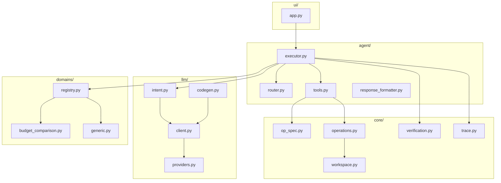
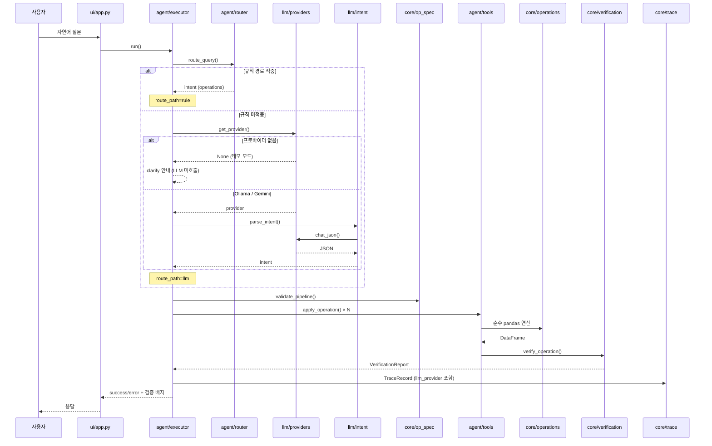
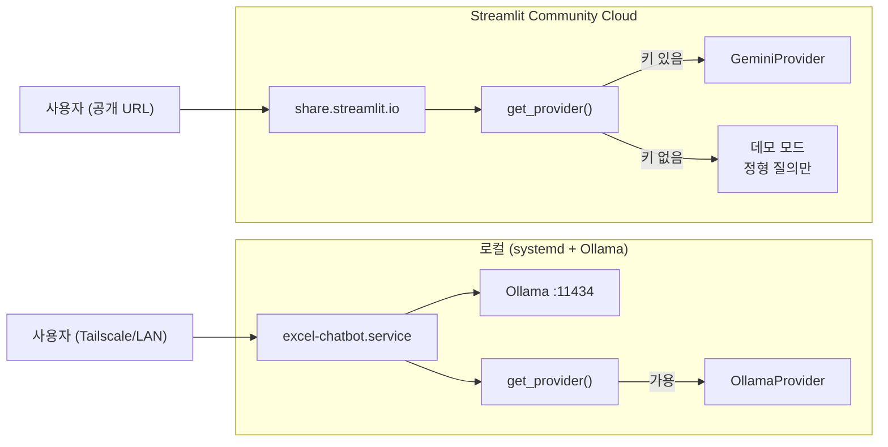

# Excel Chatbot — 로컬·클라우드 LLM 기반 Excel 분석 챗봇

Ollama(로컬) 또는 Gemini(클라우드)로 Excel 파일을 자연어로 분석하는 Streamlit 챗봇입니다.
LLM은 **계획(JSON)만 생성**하고, 모든 계산은 `core/operations.py`의 검증된 pandas 함수가 수행합니다.

[](https://github.com/JamesRhee1/excel-chatbot/actions/workflows/ci.yml)


공개 데모: 준비 중

## 핵심 원칙

> **숫자는 코드가, 말은 LLM이.**

LLM의 역할은 사용자 의도를 구조화된 JSON 명령(operation 파이프라인)으로 변환하는 것까지입니다.
실제 데이터 조작·계산은 폐쇄 연산 집합의 순수 함수가 수행하므로, 환각으로 인한 수치 오염이 구조적으로 차단됩니다.

## 계층 아키텍처

```
domains → core → llm → agent → ui
```



## 요청 처리 흐름



## 배포 토폴로지



## LLM 프로바이더

선택 로직 (`llm/providers.py`의 `get_provider()`):

1. `EXCEL_CHATBOT_LLM_PROVIDER=ollama|gemini` → 해당 프로바이더 강제
2. 미지정 시: Ollama `/api/tags` 헬스체크(2초) 통과 → Ollama
3. Ollama 불가 + `GEMINI_API_KEY` 존재 → Gemini
4. 둘 다 아니면 `None` → **데모 모드** (정형 규칙 질의만, LLM 비활성)

결과는 60초 캐시되며, 실패 후 60초 뒤 재확인합니다.

| 환경 | LLM 백엔드 | 동작 |
|---|---|---|
| 로컬 (Ollama 실행 중) | Ollama | 전체 기능 (규칙 + LLM intent) |
| Streamlit Cloud (`GEMINI_API_KEY` 설정) | Gemini | 전체 기능 (규칙 + LLM intent) |
| 키 없음 / Ollama 다운 | 없음 (데모) | 정형 질의(순위·정렬·필터·집계·파생계산)만 |

## 신뢰성 장치

| 장치 | 수치·구성 |
|---|---|
| 단위·통합 테스트 | **194**건 (`pytest`, integration 1건 제외) |
| 골든 질의 eval | **28**건 (규칙 **16** / LLM **12**) |
| CI 규칙 경로 | `run_evals.py --no-llm --strict` → 16건 100% 필수 |
| 배포 smoke test | `deploy/smoke_test.sh` **11**항목 (서비스·HTTP·E2E·트레이스) |
| 검증 계층 | table-output 연산마다 op별 불변식 (`core/verification.py`) |
| 실행 트레이스 | 질문 1건당 JSONL 1줄 (`llm_provider` 필드 포함) |

## 기능

- **단일/다중 파일 분석** — Workspace named table, 통합·비교 질의
- **rule-first 라우팅** — 정형 패턴은 LLM 없이 즉시 처리
- **프로바이더 계층** — Ollama 우선 → Gemini 폴백 → 데모 강등
- **도메인 팩** — 예실대비표 자동 감지·정규화 (`budget_comparison` / `generic`)
- **파생 컬럼** — add / subtract / multiply / divide / percent / abs_diff
- **대화 체이닝** — `last_result` 기반 후속 질의
- **(선택) 코드 실행 escape hatch** — `EXCEL_CHATBOT_ENABLE_CODEGEN=1` + 사용자 승인

## 빠른 시작

```bash
git clone https://github.com/JamesRhee1/excel-chatbot.git
cd excel-chatbot
pip install -e ".[dev]"

ollama pull qwen2.5:7b
ollama serve

streamlit run ui/app.py
```

브라우저: http://localhost:8501

**예시 질문**

```
데이터에 대해서 설명
당해예산 중에 가장 높은 행 찾아줘
인쇄비가 얼마지
비목분류별 당년도예산 합계 보여줘
예산잔액에서 가집행금액 뺀 값 컬럼 만들어줘
이 중에서 상위 3개만 보여줘
파일별 집행률 비교해줘
```

## 환경변수

| 변수 | 기본값 | 설명 |
|---|---|---|
| `OLLAMA_MODEL` | `qwen2.5:7b` | Ollama intent 파싱 모델 |
| `EXCEL_CHATBOT_LLM_PROVIDER` | (미설정) | `ollama` 또는 `gemini`로 프로바이더 강제 |
| `GEMINI_API_KEY` | (미설정) | Gemini API 키 (클라우드·폴백) |
| `GEMINI_MODEL` | `gemini-2.0-flash` | Gemini 모델명 |
| `EXCEL_CHATBOT_TRACE_DIR` | `./traces/` | JSONL 트레이스 경로 |
| `EXCEL_CHATBOT_ENABLE_CODEGEN` | (미설정) | `1`일 때만 코드 실행 escape hatch 활성 |

Streamlit Cloud에서는 `GEMINI_API_KEY`를 Secrets에 설정하면 `ui/app.py`가 시작 시 `os.environ`에 주입합니다.

## 지원 연산 (20종)

`core/op_spec.py`의 `OPERATION_SPECS` 단일 정의:

`aggregate` · `clarify` · `combine_dataset` · `compare_item_across_files` ·
`derive` · `describe_dataset` · `exclude_summary` · `filter` · `filter_row_type` ·
`help` · `lookup` · `multi_summary` · `select` · `sort` · `summary_stats` ·
`summarize_by_file` · `top_n` · `top_n_by_file` · `top_n_overall` · `value_answer`

## 평가

```bash
python evals/run_evals.py --no-llm --strict   # 규칙 16건, CI와 동일
python evals/run_evals.py                     # 전체 28건 (LLM 필요)
```

## 테스트

```bash
pytest                       # 194건 (integration 1건 제외)
pytest -m integration        # Ollama 연동 (로컬 서버 필요)
```

## 프로젝트 구조

```
excel-chatbot/
├── .github/workflows/ci.yml
├── .streamlit/config.toml
├── deploy/
│   ├── excel-chatbot.service
│   ├── excel-chatbot-trace-cleanup.service
│   ├── excel-chatbot-trace-cleanup.timer
│   ├── install.sh
│   └── smoke_test.sh
├── domains/
│   ├── base.py
│   ├── budget_comparison.py
│   ├── generic.py
│   └── registry.py
├── core/
│   ├── op_spec.py
│   ├── operations.py
│   ├── table_operations.py
│   ├── dataset_builder.py
│   ├── workspace.py
│   ├── workspace_loader.py
│   ├── verification.py
│   ├── trace.py
│   ├── sandbox_runner.py
│   ├── sandbox_child.py
│   └── reader.py / writer.py / profiler.py / column_resolver.py
├── llm/
│   ├── providers.py          # Ollama / Gemini 선택
│   ├── client.py
│   ├── intent.py
│   └── codegen.py
├── agent/
│   ├── executor.py
│   ├── router.py
│   ├── tools.py
│   └── response_formatter.py / presentation.py / intent_utils.py
├── ui/app.py
├── evals/
│   ├── golden_queries.yaml
│   ├── run_evals.py
│   └── fixtures/
└── tests/                    # 18개 파일, 194 케이스
```

## 문서

| 문서 | 내용 |
|---|---|
| [ARCHITECTURE.md](ARCHITECTURE.md) | 계층 설계, 프로바이더 선택, 실행 흐름, 설계 결정 |
| [docs/EVALUATION.md](docs/EVALUATION.md) | 평가 하네스, 지표, 골든 질의 스키마 |
| [docs/EXTENDING.md](docs/EXTENDING.md) | 새 연산·도메인 팩 추가 |
| [docs/DEPLOYMENT.md](docs/DEPLOYMENT.md) | systemd 로컬 운영 + Streamlit Cloud 공개 데모 |

## 라이선스

MIT
