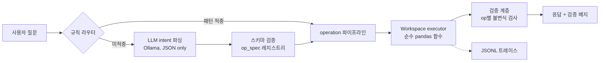

# Excel Chatbot — 로컬 LLM 기반 Excel 분석 챗봇

Ollama 로컬 LLM으로 Excel 파일을 자연어로 분석하는 Streamlit 챗봇입니다.
LLM은 **계획만 세우고, 모든 계산은 검증된 pandas 함수가 수행**하며,
모든 연산 결과는 불변식 검사를 거쳐 검증 배지와 함께 반환됩니다.

## 핵심 원칙

> **숫자는 코드가, 말은 LLM이.**

LLM의 역할은 사용자 의도를 구조화된 JSON 명령(operation 파이프라인)으로
변환하는 것까지입니다. 실제 데이터 조작·계산은 폐쇄된 연산 집합의
순수 함수가 수행하므로, **환각으로 인한 수치 오염이 구조적으로 불가능**합니다.

이 원칙 위에 세 가지 신뢰성 장치가 더해져 있습니다.

| 장치 | 역할 |
|---|---|
| 검증 계층 | 모든 연산 결과에 op별 불변식 검사 (행수 보존, 합계 재대사 등) — 응답에 `✓ 검증됨` 배지 표시 |
| 실행 트레이스 | 질문 1건당 라우팅 경로·연산·소요시간·검증 결과를 JSONL 1줄로 기록 |
| 평가 하네스 | 골든 질의 20개로 라우팅 적중률·연산 일치율·답변 정확도를 회귀 측정 |

## 기능

- **단일/다중 파일 분석** — 파일 여러 개를 올리면 Workspace에 named table로
  등록되어 통합·비교 질의 가능 (`"파일별 당년도예산 합계 비교해줘"`)
- **rule-first 라우팅** — 정형 패턴은 LLM 호출 없이 즉시 처리, 그 외에만
  LLM intent 파싱으로 폴백
- **도메인 팩** — 예실대비표(2행 헤더) 자동 감지·정규화. 일반 표는 generic
  팩으로 처리되며, 새 문서 양식은 팩 추가만으로 지원 가능
- **파생 컬럼 계산** — `"예산잔액에서 가집행금액 뺀 값 컬럼 만들어줘"` →
  add / subtract / multiply / divide / percent / abs_diff
- **대화 체이닝** — `"이 중에서 상위 3개"`처럼 직전 결과(`last_result`)를
  이어서 분석
- **컬럼명 유연 해석** — `"당해예산"` → `당년도예산` 자동 매핑 (동의어 사전 +
  fuzzy 매칭)
- **(선택) 코드 실행 escape hatch** — 폐쇄 연산으로 표현 불가한 요청에 한해,
  플래그 활성 + 사용자 승인 시 서브프로세스 격리 환경에서 LLM 생성 코드 실행

## 빠른 시작

```bash
git clone https://github.com/JamesRhee1/excel-chatbot.git
cd excel-chatbot
pip install -e ".[dev]"

# Ollama 준비 (로컬)
ollama pull qwen2.5:7b
ollama serve

# 앱 실행
streamlit run ui/app.py
```

브라우저에서 http://localhost:8501 접속 후 xlsx 파일을 업로드하고 질문합니다.

**예시 질문**

```
데이터에 대해서 설명
당해예산 중에 가장 높은 행 찾아줘
인쇄비가 얼마지
비목분류별 당년도예산 합계 보여줘
예산잔액에서 가집행금액 뺀 값 컬럼 만들어줘
이 중에서 상위 3개만 보여줘
파일별 집행률 비교해줘        # 다중 파일 업로드 시
```

## 환경변수

| 변수 | 기본값 | 설명 |
|---|---|---|
| `OLLAMA_MODEL` | `qwen2.5:7b` | intent 파싱에 사용할 Ollama 모델 |
| `EXCEL_CHATBOT_TRACE_DIR` | `./traces/` | JSONL 실행 트레이스 기록 경로 |
| `EXCEL_CHATBOT_ENABLE_CODEGEN` | (미설정) | `1`일 때만 코드 실행 escape hatch 활성. 미설정 시 해당 요청은 clarify로 안내 |

## 아키텍처 개요

```
domains → core → llm → agent → ui
```



- `domains/` — 문서 양식별 감지·정규화·어휘 (예실대비표 / generic)
- `core/` — 순수 DataFrame 연산, Workspace, op 레지스트리, 검증, 트레이스, 샌드박스
- `llm/` — Ollama 클라이언트 + intent/codegen 프롬프트 (agent 무의존)
- `agent/` — 라우팅·오케스트레이션·응답 포맷팅
- `ui/` — Streamlit (단일 진입점 `agent.executor.run`만 호출)

상세 설계는 [ARCHITECTURE.md](ARCHITECTURE.md)를 참고하세요.

## 지원 연산 (폐쇄 집합)

LLM이 계획에 사용할 수 있는 연산은 `core/op_spec.py`에 단일 정의되어
있으며, 스키마 검증·디스패치·LLM 프롬프트 예시가 모두 이 레지스트리에서
파생됩니다.

`filter` · `sort` · `select` · `aggregate` · `top_n` · `lookup` ·
`value_answer` · `summary_stats` · `derive` · `exclude_summary` ·
`filter_row_type` · `describe_dataset` · `help` · `clarify` ·
`combine_dataset` · `summarize_by_file` · `compare_item_across_files` ·
`top_n_by_file` · `top_n_overall` · `multi_summary`

각 연산은 입출력 타입(`table`/`scalar`/`message`)이 선언되어 있고,
실행 전에 `validate_pipeline()`이 source 테이블 존재 여부와 타입 호환성을
검사합니다. `save_as`로 중간 결과를 Workspace에 저장해 후속 질의에서
재사용할 수 있습니다.

## 평가

```bash
python evals/run_evals.py --no-llm   # 규칙 경로만, Ollama 불필요 (CI용)
python evals/run_evals.py            # 전체 20개 (Ollama 필요)
```

골든 질의 20개(규칙 경로 12 / LLM 경로 8)에 대해 라우팅 적중률·연산 시퀀스
일치율·답변 정확도·검증 통과율을 집계합니다. 현재 규칙 경로 기준 4개 지표
모두 100%입니다. 상세는 [docs/EVALUATION.md](docs/EVALUATION.md) 참고.

## 테스트

```bash
pytest                       # 160+ 케이스 (Ollama 불필요)
pytest -m integration        # Ollama 연동 테스트 (로컬 서버 필요)
```

## 프로젝트 구조

```
excel-chatbot/
├── domains/                    # 도메인 팩 (최하위 계층)
│   ├── base.py                 #   DomainPack 인터페이스
│   ├── budget_comparison.py    #   예실대비표 팩 (감지·정규화·동의어·파생지표)
│   ├── generic.py              #   폴백 팩
│   └── registry.py             #   팩 매칭·프로파일 보강
├── core/
│   ├── op_spec.py              # 연산 스키마 단일 출처 + validate_pipeline
│   ├── operations.py           # 순수 DataFrame 연산 (filter/sort/derive/...)
│   ├── table_operations.py     # 다중 테이블 연산 (비교/파일별 집계)
│   ├── dataset_builder.py      # 다중 파일 통합 DataFrame 구성
│   ├── workspace.py            # named table 컨테이너 (last_result 포함)
│   ├── workspace_loader.py     # 파일 → Workspace 적재
│   ├── verification.py         # op별 불변식 검사
│   ├── trace.py                # JSONL 실행 트레이스
│   ├── sandbox_runner.py       # escape hatch (subprocess -I 격리)
│   ├── sandbox_child.py        #   자식 프로세스 (setrlimit 메모리 상한)
│   ├── reader.py / writer.py / profiler.py / column_resolver.py
│   └── budget_table_normalizer.py
├── llm/
│   ├── client.py               # Ollama 래퍼
│   ├── intent.py               # 자연어 → operation JSON
│   └── codegen.py              # escape hatch용 코드 생성 프롬프트
├── agent/
│   ├── executor.py             # run() 단일 진입점
│   ├── router.py               # 규칙 기반 라우팅 (LLM 선행)
│   ├── tools.py                # op 디스패치
│   └── response_formatter.py / presentation.py / intent_utils.py
├── ui/app.py                   # Streamlit
├── evals/                      # 골든 질의셋 + 실행기 + 합성 픽스처
└── tests/                      # 16개 파일, 160+ 케이스
```

## 문서

| 문서 | 내용 |
|---|---|
| [ARCHITECTURE.md](ARCHITECTURE.md) | 계층 설계, 실행 흐름, 설계 결정 근거, escape hatch 격리 설계 |
| [docs/EVALUATION.md](docs/EVALUATION.md) | 평가 하네스 사용법, 지표 정의, 골든 질의셋 스키마 |
| [docs/EXTENDING.md](docs/EXTENDING.md) | 새 연산·새 도메인 팩 추가 가이드 |

## 라이선스

MIT
